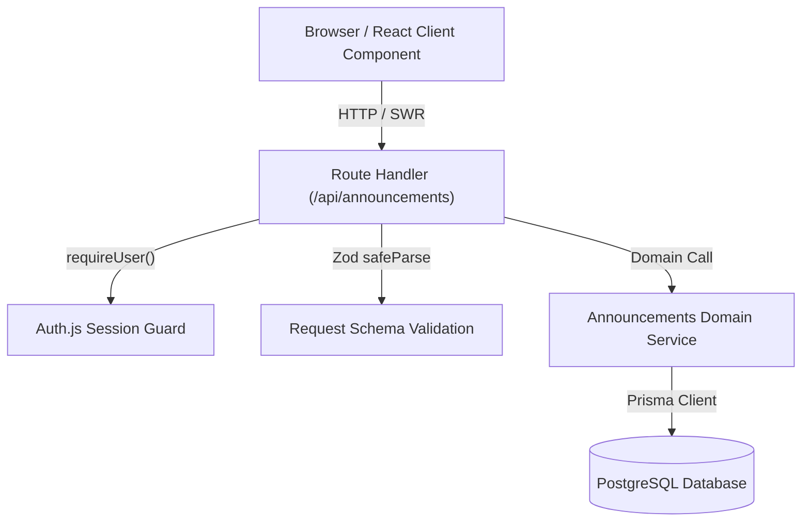

# TeamPulse

A secure, production-grade internal announcements portal built with Next.js (App Router), Auth.js, Prisma ORM, PostgreSQL, Zod, and SWR.

---

## Overview

**TeamPulse** is an internal team communications platform engineered as a clean, complete vertical slice for company-wide updates. It demonstrates production-minded architecture across frontend and backend in a unified Next.js App Router codebase, with defense-in-depth authentication, strict runtime validation, relational persistence, accessible components, and decoupled state management.

---

## Features

* **Authenticated Team Portal**: Protected corporate announcements section inaccessible to unauthenticated visitors.
* **Credentials Authentication**: Secure credentials verification powered by Auth.js with `bcryptjs` password hashing and HTTP-only sessions.
* **Dual-Layer Route & API Protection**: Independent server-side authorization guards at both layout/middleware boundaries and API Route Handlers.
* **Announcement Publishing**: Controlled creation form featuring real-time length tracking, validation feedback, and duplicate submission prevention.
* **Live Feed & Cache Invalidation**: SWR-powered remote state management providing instant local updates and background revalidation.
* **Polished UX States**: Granular loading skeletons, contextual error banners with retry capabilities, and accessible empty states.
* **Corporate Visual Aesthetic**: Modern, responsive, restrained SaaS interface built with Tailwind CSS.

---

## Tech Stack

| Layer | Technology | Rationale |
| :--- | :--- | :--- |
| **Framework** | Next.js 14 (App Router) | Unified full-stack framework with React Server Components (RSC) and thin Route Handlers. |
| **Language** | TypeScript (Strict Mode) | Type safety across system boundaries with zero `any` tolerance. |
| **Styling** | Tailwind CSS | Utility-first CSS ensuring accessible, responsive, and maintainable styling without design debt. |
| **Authentication** | Auth.js (NextAuth.js v5) | Standard session lifecycle, HTTP-only cookie security, and middleware integration. |
| **Password Hashing** | `bcryptjs` | Industry standard salted password hashing (10 rounds). |
| **Database & ORM** | PostgreSQL 16 + Prisma ORM | Durable ACID relational persistence with declarative migrations and type-safe query projections. |
| **Validation** | Zod | Runtime schema validation for HTTP requests and form inputs. |
| **Remote State** | SWR | Lightweight HTTP cache, deduping, and programmatic mutation without global store bloat. |
| **Testing** | Vitest + Playwright | Fast unit/integration testing for schemas and APIs, plus browser-based end-to-end journey tests. |

---

## Architecture

TeamPulse adheres strictly to unidirectional data flow and clear separation of concerns:



### Flow Breakdown
1. **Presentation (Client/Server Components)**: Renders UI, captures local input state, and delegates remote state to SWR. Server components remain the default.
2. **API Route Handlers**: Act as thin orchestrators. Route Handlers verify authentication, validate incoming payloads, invoke domain services, and return standard JSON envelopes.
3. **Domain Services (`lib/`)**: Colocate business rules and database queries. Presentation components never touch Prisma directly.
4. **Data Persistence**: PostgreSQL enforces constraints, indexes, and cascades through Prisma migrations.

---

## Project Structure

```text
team-pulse/
├── app/
│   ├── api/
│   │   ├── auth/[...nextauth]/route.ts  # Auth.js Route Handlers
│   │   └── announcements/route.ts       # Protected announcements REST endpoint (GET, POST)
│   ├── login/page.tsx                   # Public authentication page
│   ├── announcements/
│   │   ├── layout.tsx                   # Authenticated portal shell with AppHeader
│   │   ├── loading.tsx                  # Instant visual skeleton loader
│   │   └── page.tsx                     # Server Component entry point
│   ├── layout.tsx                       # Root layout
│   ├── page.tsx                         # Root redirect (/announcements or /login)
│   └── globals.css                      # Global styles and Tailwind base
├── components/
│   ├── announcements/
│   │   ├── announcement-card.tsx        # Announcement presentation card
│   │   ├── announcement-form.tsx        # Controlled form with local state
│   │   └── announcement-list.tsx        # SWR remote state container (loading, error, empty)
│   ├── auth/
│   │   └── login-form.tsx               # Credentials sign-in form
│   ├── layout/
│   │   ├── app-header.tsx               # Top navigation bar
│   │   └── user-menu.tsx                # User identity display and logout trigger
│   └── ui/                              # Atomic accessible primitives (Button, Input, Textarea, etc.)
├── lib/
│   ├── auth/
│   │   ├── auth.ts                      # NextAuth server configuration & Credentials Provider
│   │   ├── auth.config.ts               # Edge-compatible routing callbacks
│   │   └── require-user.ts              # Reusable server-side security helper
│   ├── announcements/
│   │   └── service.ts                   # Domain service for announcements queries
│   ├── db/
│   │   └── prisma.ts                    # Prisma Client singleton
│   └── validation/
│       ├── announcement.ts              # Zod schema for announcement creation
│       └── auth.ts                      # Zod schema for credentials login
├── prisma/
│   ├── schema.prisma                    # PostgreSQL schema definition
│   └── seed.ts                          # Idempotent seed script with hashed demo user
├── tests/
│   ├── unit/                            # Zod schema validation tests
│   ├── integration/                     # Route Handler authorization and API tests
│   └── e2e/                             # Playwright end-to-end user journey tests
├── .agents/skills/                      # Antigravity reusable engineering skills
├── AGENTS.md                            # Primary AI engineering standards contract
├── docker-compose.yml                   # Containerized PostgreSQL service
├── .env.example                         # Environment configuration template
├── package.json
└── tsconfig.json
```

---

## Authentication

Authentication is implemented using **Auth.js** (`next-auth@5`) configured with the Credentials Provider:

* **Session Strategy**: Secure JWT stored in HTTP-only, encrypted session cookies.
* **Defense-in-Depth**:
  * **Page-Level Protection**: `middleware.ts` and `app/announcements/layout.tsx` inspect the active session and redirect unauthenticated requests directly to `/login`.
  * **API-Level Protection**: Every protected API route independently calls `requireUser()` in `lib/auth/require-user.ts`. Client requests cannot bypass API authentication even if page middleware were altered.
* **Author Identity Integrity**: When creating an announcement, the author identity is bound exclusively from `session.user.id`. Any client-submitted `authorId` is completely ignored.
* **No Plaintext Passwords**: Passwords are saved only as `bcryptjs` hashes with 10 salt rounds. Password hashes are explicitly excluded from database select projections.

---

## API Design

The API adheres to REST standards and uses consistent JSON response envelopes:

### 1. `GET /api/announcements`
* **Access**: Authenticated users only (HTTP 401 if missing session).
* **Response `200 OK`**:
  ```json
  {
    "data": [
      {
        "id": "cmu2k...",
        "title": "Welcome to TeamPulse!",
        "body": "Welcome to our internal announcements portal...",
        "createdAt": "2026-09-15T10:57:35.000Z",
        "updatedAt": "2026-09-15T10:57:35.000Z",
        "author": {
          "id": "cmu2k...",
          "name": "Demo User"
        }
      }
    ]
  }
  ```

### 2. `POST /api/announcements`
* **Access**: Authenticated users only (HTTP 401 if missing session).
* **Request Payload**:
  ```json
  {
    "title": "Quarterly Engineering Review",
    "body": "The all-hands meeting is scheduled for Friday at 14:00 UTC."
  }
  ```
* **Validation Rules**:
  * `title`: string, required, trimmed, min 3 characters, max 120 characters.
  * `body`: string, required, trimmed, min 3 characters, max 2000 characters.
* **Response `201 Created`**: Returns `{ "data": { ...createdAnnouncement } }`.
* **Response `400 Bad Request`**:
  ```json
  {
    "error": {
      "message": "Validation failed.",
      "details": {
        "title": ["Title must be at least 3 characters"]
      }
    }
  }
  ```

---

## Database Model

The relational PostgreSQL schema is modeled in `prisma/schema.prisma`:

```prisma
model User {
  id            String         @id @default(cuid())
  name          String
  email         String         @unique
  passwordHash  String
  createdAt     DateTime       @default(now())
  announcements Announcement[]

  @@map("users")
}

model Announcement {
  id        String   @id @default(cuid())
  title     String
  body      String   @db.Text
  authorId  String
  createdAt DateTime @default(now())
  updatedAt DateTime @updatedAt
  author    User     @relation(fields: [authorId], references: [id], onDelete: Cascade)

  @@index([createdAt(sort: Desc)])
  @@map("announcements")
}
```

* **Data Integrity**: Unique index on `User(email)`. Foreign key with `onDelete: Cascade` connects announcements to users.
* **Performance**: Index on `Announcement(createdAt(sort: Desc))` ensures feed retrieval queries execute in logarithmic time.

---

## Getting Started

### Prerequisites
* **Node.js**: v18.18.0+ or v20+ (tested on Node v22)
* **npm**: v9+ (tested on npm 11)
* **Docker & Docker Compose**: For containerized PostgreSQL

---

## Environment Variables

Copy `.env.example` to `.env`:

```bash
cp .env.example .env
```

Variables defined in `.env`:
* `POSTGRES_USER`: PostgreSQL user (default: `teampulse`).
* `POSTGRES_PASSWORD`: Secure PostgreSQL password (interpolated by Docker Compose).
* `POSTGRES_DB`: PostgreSQL database name (default: `teampulse_db`).
* `DATABASE_URL`: Connection string used by Prisma ORM (`postgresql://...`).
* `AUTH_SECRET`: Random 32+ character high-entropy secret for Auth.js cookie encryption.
* `NEXTAUTH_URL`: Base URL of the portal (`http://localhost:3000`).

---

## Database Setup

Start the isolated PostgreSQL container:

```bash
docker compose up -d
```

Verify the container is healthy:

```bash
docker ps
```

---

## Database Migrations

Apply Prisma database migrations to create the schema and tables:

```bash
npm run prisma:migrate
```

*(Alternatively: `npx prisma migrate dev`)*

---

## Seed Data

Populate the database with the assessment demo user and sample announcements:

```bash
npm run prisma:seed
```

*(Alternatively: `npx prisma db seed`)*

---

## Demo Credentials

For testing and assessment review:

| Field | Value |
| :--- | :--- |
| **Email** | `demo@teampulse.internal` |
| **Password** | `Password123!` |
| **Role** | Authenticated Employee (`Demo User`) |

---

## Running the Application

### Development Mode
```bash
npm run dev
```
Open [http://localhost:3000](http://localhost:3000) in your browser.

### Production Build & Run
```bash
npm run build
npm run start
```

---

## Running Tests

### Unit and Integration Tests (Vitest)
Executes schema validation tests and Route Handler security/authorization tests:
```bash
npm run test
```

### End-to-End Tests (Playwright)
Executes the full browser-based user journey (login -> view -> create -> verify -> logout -> guard):
```bash
npm run test:e2e
```

### Static Quality Verification
Run static analysis and type checks:
```bash
npm run lint
npm run typecheck
```

---

## Design Decisions

### 1. Why Announcements?
The assessment calls for a clean, cohesive vertical slice with creating and viewing functionality. Announcements represent an essential internal team tool that tests full-stack competency (authentication, relational persistence, input validation, accessible forms, and server cache synchronization) without unnecessary surface area.

### 2. Why No Public Self-Registration?
TeamPulse is designed as an internal enterprise intranet tool. In real-world enterprise environments, employee accounts are provisioned via SSO, SCIM, or administrative seeding—not self-signup on a public form. Excluding registration honors realistic business constraints and keeps the scope strictly focused.

### 3. Why PostgreSQL?
The relationship between users and announcements is relational with strict referential integrity. PostgreSQL provides ACID compliance, strong foreign key constraints, and descending b-tree index support.

### 4. Why Prisma ORM?
Prisma provides type-safe query generation matching the schema, automatic migration history tracking, and compile-time validation of database models without writing error-prone manual SQL strings.

### 5. Why No Redux or Zustand?
There is no complex client-side state in this application. Form fields, character counts, and pending indicators belong strictly in **local React state** (`useState`). Remote announcements belong in **server state** handled by **SWR**, which provides automated caching, focus revalidation, and programmatic cache mutation. Introducing Redux would add unnecessary boilerplate and cognitive overhead.

### 6. Why Next.js Route Handlers?
The evaluation criteria explicitly emphasize backend and API integration. Route Handlers (`app/api/announcements/route.ts`) provide clear HTTP REST boundaries, making the API independently testable with standard HTTP semantics and decoupling the presentation layer from the data layer.

---

## Security Considerations

1. **Zero Secret Leakage**: Database URLs, Docker passwords, and `AUTH_SECRET` are never exposed to the client bundle (`NEXT_PUBLIC_*`).
2. **Server-Side Authorization**: Client-side form checks are purely for UX. Every API endpoint independently enforces authentication and throws `401 Unauthorized` on missing tokens.
3. **No Author Spoofing**: `authorId` is derived exclusively from the verified server session; payload attempts to override `authorId` are ignored.
4. **Credential Safety**: Passwords are never saved in plaintext; `passwordHash` is excluded from all client-facing queries.
5. **Generic Error Responses**: Login failures return a generic message to prevent username/email enumeration.

---

## Tradeoffs

1. **Credentials vs. OAuth/SSO**: For an internal portal, Google/Okta SSO would be standard. A Credentials Provider was chosen here to make the assessment entirely self-contained without requiring external API keys.
2. **Polling / SWR vs. WebSockets**: SWR revalidates on focus and immediately on user action. For this scope, SWR provides an optimal balance between complexity and real-time feel without maintaining persistent WebSocket server connections.
3. **Pagination**: The announcements feed displays recent announcements newest first. In a massive organization with thousands of posts, cursor-based pagination would be added.

---

## Future Improvements

* **Rich Text / Markdown**: Render announcement bodies with safe Markdown formatting.
* **Targeted Audiences**: Segment announcements by department, team, or office location.
* **Pinned Announcements**: Allow team leads to pin critical announcements to the top of the feed.
* **Read Receipts**: Track acknowledgment of compliance or safety announcements.
