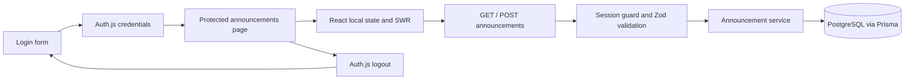

# Architecture and API reference

## Boundaries

- `app/`: pages, layouts, and thin HTTP Route Handlers.
- `components/`: presentation, local form state, and SWR feed integration.
- `lib/validation/`: shared login and announcement input schemas.
- `lib/announcements/`: database services and browser response contracts.
- `lib/db/`: Prisma singleton and credential lookup.
- `lib/auth/`: reusable API session guard.
- `prisma/`: schema, migrations, and local demo seed.
- `tests/`: unit, mocked API integration, and real browser lifecycle tests.

Middleware uses the Edge-compatible `auth.config.ts`; `auth.ts` adds database
credential verification in the Node runtime. Password verification uses bcrypt
with 10 salt rounds for seeded accounts. The session includes user identity but
never the password hash. API access does not depend on middleware alone.

## Database

`User` stores ID, name, unique email, password hash, and creation time.
`Announcement` stores ID, title, body, author ID, and creation/update timestamps.
A foreign key links each announcement to its author with cascading deletion.
A descending creation-time index supports newest-first queries. Queries select
only public author ID and name for announcement responses.

## API

Both endpoints require an authenticated session and return `401` otherwise.

| Endpoint | Success | Behavior |
| --- | --- | --- |
| `GET /api/announcements` | `200 { data: Announcement[] }` | Returns the feed newest first. |
| `POST /api/announcements` | `201 { data: Announcement }` | Creates an announcement for the session user. |

POST accepts `{ "title": "Team update", "body": "The release is ready." }`.
Both fields are trimmed. Title length must be 3–120 characters; body length must
be 3–2000 characters. Extra fields, including a supplied `authorId`, are stripped.
Malformed JSON or invalid input returns `400` with
`{ error: { message, details? } }`; field validation details contain string arrays.
Unexpected errors return `500` with a sanitized message.

An announcement response has `id`, `title`, `body`, ISO-string `createdAt` and
`updatedAt`, and `author: { id, name }`. Zod response schemas live in
`lib/announcements/contracts.ts`.

## UI behavior

The feed supports loading skeletons, an empty state, network-error retry, and a
publication confirmation. A successful POST updates the cache from its response,
so a follow-up read failure cannot hide the saved item. A `401` from reading or
publishing replaces the feed/composer with an explicit session-expired message
and a sign-in link. Authentication errors are not automatically retried.

## Test isolation

The same browser suite runs in desktop Chromium, Pixel 7 Chromium emulation, and
desktop Firefox. Rejected-login cases verify the same generic message and denied
API/page access for unknown emails and incorrect passwords on a known account.
The complete publishing journey checks that the feed and composer fit the viewport.

`playwright.config.ts` starts a dedicated production server and refuses to reuse
an existing server. `tests/e2e/environment.ts` supplies fixed local test settings.
Global setup starts the `teampulse-e2e` Compose project, migrates and seeds its
database, and registers teardown. PostgreSQL data lives in temporary container
memory, without the development database volume. Setup failures attempt cleanup
and propagate the original error. Abruptly interrupted runs can be cleaned using
the command in the README; the next setup also removes leftover test containers.
